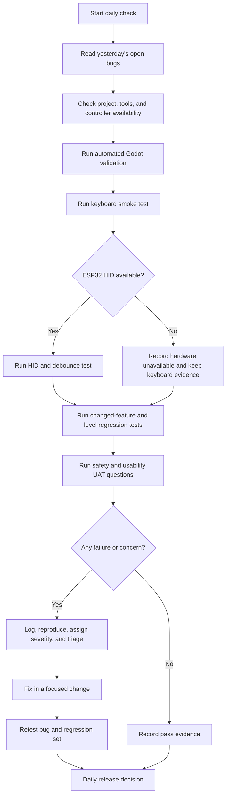
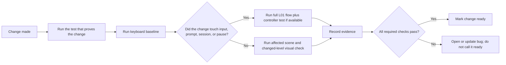

# PETER RUN — Daily Bug Check, UAT, and Regression Guide

**Purpose:** run the same short quality check every day so a calm rehabilitation prototype stays safe, playable, and exportable as code, art, scenes, and ESP32 firmware change.

**Applies to:** the Godot desktop game, its GDScript and scenes, imported assets, the keyboard fallback, and the ESP32 HID controller. This guide does not replace clinical approval. A therapist owns movement safety, session settings, and progression decisions.

## 1. Quality rules

1. A missed prompt is neutral: no game-over, punishment, or alarming feedback.
2. The player must be able to pause or stop immediately by mouse/trackpad.
3. Only one movement prompt may be active at a time.
4. A single physical movement may record at most one game action.
5. A controller problem must not block keyboard testing.
6. A change is not done until its relevant regression tests pass and evidence is recorded.
7. Never mark a clinical/safety issue as fixed without a therapist retest.

## 2. Daily workflow at a glance



**Suggested timebox:** 20–30 minutes for an ordinary day; 45–60 minutes after controller, input, prompt, or session-flow changes.

## 3. Before testing: establish the test state

Use a fresh local build state when practical. Do not test a scene with unsaved changes and call the result a release test.

| Check | Expected result | If unavailable or failing |
| --- | --- | --- |
| Git/status or change list | Tester knows exactly what changed today | Write the changed files manually in the evidence report. |
| Godot project file | `project.godot` is present in the game folder | Mark environment blocked; do not invent test results. |
| Godot editor/CLI | Editor opens or command is available | Run visual/manual checks later; log tool availability. |
| Keyboard | `A`, `D`, `W`, `S`, mouse/trackpad work | This is a P0 blocker because the fallback test path is unavailable. |
| ESP32 controller | It appears to Windows as a HID keyboard | Mark **hardware unavailable**, not product failed, if the device is absent. |
| Test session config | Affected-side mapping, level, and prescribed targets are recorded | Do not begin UAT until the configuration is known. |

### Safe environment checks

Run these from the folder containing the Godot project. They are diagnostic only; they do not change project files.

**PowerShell on Windows**

```powershell
Get-Location
Test-Path .\project.godot
Get-Command godot -ErrorAction SilentlyContinue
Get-Command Godot_v4* -ErrorAction SilentlyContinue
Get-PnpDevice -PresentOnly | Where-Object { $_.FriendlyName -match 'ESP32|HID|Keyboard' } |
  Select-Object Status, Class, FriendlyName
```

**Bash / Codex terminal**

```bash
pwd
test -f project.godot && echo 'project.godot found' || echo 'project.godot missing'
command -v godot || true
rg --files -g 'project.godot' -g '*.gd' -g '*.tscn' -g '*.tres' .
```

The ESP32 line is informational. Windows often labels a Bluetooth HID device generically as a keyboard, so the real proof is the Notepad and in-game tests below.

## 4. Automated validation

Automated validation catches broken references and script parse errors early. It does **not** prove that therapy movement is safe or that the game feels clear.

### 4.1 Preferred commands

Use the first command that exists on the tester's computer. Replace `godot` with the discovered executable path if needed.

```bash
# Check scripts and project resources without opening a window.
godot --headless --path . --editor --quit

# Run the project in a test-friendly mode when a dedicated test scene exists.
godot --headless --path . --quit-after 20
```

For a future automated test runner, keep tests in `tests/` and make the command explicit in the project README, for example:

```bash
godot --headless --path . -s res://tests/test_runner.gd
```

Only add that final command after `tests/test_runner.gd` has actually been created. Never report it as passing before it exists.

### 4.2 Graceful outcomes

| Condition | Record as | What to do next |
| --- | --- | --- |
| Command exits with no parser/load errors | Pass | Continue to keyboard smoke test. |
| Command reports GDScript parse, missing resource, or scene-load error | Fail | File a P1 or P2 bug depending on whether launch is blocked. |
| Godot command is not installed or is not on PATH | Environment unavailable | Open the project in the Godot editor, or record the missing tool. Do not call it a passing automated test. |
| Project has no automated tests yet | Not implemented | Complete manual smoke/UAT, then add test coverage as a planned task. |
| Headless validation fails only because a display-only plugin is used | Needs investigation | Reproduce in the editor; keep the output as evidence. |

### 4.3 Minimum automated assertions once the test runner exists

- A project can load the Main Menu scene.
- Input actions `move_left`, `move_right`, `jump`, `slide`, and `pause` exist.
- Every level definition has a theme, prescribed targets, and valid prompt data.
- A prompt has exactly one expected action.
- A completed prescribed target advances to summary; it never routes to a game-over screen.
- Left/right mapping changes correctly when the affected-side setting is toggled.
- A debounce window rejects a duplicate input.

## 5. Manual smoke test: keyboard baseline

Keyboard testing is the required baseline even when the ESP32 is working. Use the built-in keyboard mapping:

| Physical key | Expected Godot action | Expected visible result |
| --- | --- | --- |
| `A` | `move_left` | Player changes one lane left, or gives a neutral boundary response at the left edge. |
| `D` | `move_right` | Player changes one lane right, or gives a neutral boundary response at the right edge. |
| `W` | `jump` | One clear forward-step/jump response when that prompt is active. |
| `S` | `slide` | One clear backward-step/slide response when that prompt is active. |
| Mouse/trackpad Pause button | `pause` | Gameplay stops immediately and pause menu is reachable. |
| Resume button | resume | Gameplay resumes without resetting the counted repetitions. |

Run this sequence in L01 Barangay Morning before testing later levels:

1. Launch from Main Menu and reach Patient Setup.
2. Confirm the test configuration: affected-side setting, target repetitions, keyboard mode, and L01.
3. Open the tutorial; confirm it explains only one action at a time.
4. Start the level and wait for each of the four prompt types / controls available in the current build.
5. Trigger the matching key exactly once. Confirm one response, readable feedback, and the correct counter change.
6. Intentionally give a wrong key or wait for a prompt to expire. Confirm neutral feedback, no game-over, and continued session.
7. Pause during an active prompt. Confirm time/scrolling stops and the player can resume or end safely.
8. Complete the prescribed target. Confirm summary and exertion rating appear; verify the user is not automatically sent to a harder level.

## 6. ESP32 HID controller test

### 6.1 Test outside Godot first

1. Power and pair/connect the ESP32.
2. Open Notepad or another empty text field.
3. Perform one intended movement at a time with rest between them.
4. Confirm the controller produces exactly one expected character (`A`, `D`, `W`, or `S`) per movement.
5. Confirm it produces no character while stationary and does not hold a key down.

If this fails, stop gameplay testing for the affected controller action and record a **firmware/hardware input bug**. Do not compensate by weakening the Godot debounce without evidence.

### 6.2 Test in Godot

Run the keyboard smoke sequence again using the ESP32. Capture the following for each action:

| Test | Pass condition |
| --- | --- |
| Recognition | One intended movement reaches the intended Godot action. |
| Debounce | One movement increments or reacts once only. |
| Cooldown | A deliberate second movement after the approved cooldown can register. |
| No false trigger | Resting, shifting the walker, or minor tremor does not trigger action. |
| Mapping | Affected-side setting maps left/right as specified by the therapist. |
| Recovery | Disconnect/reconnect does not crash the game; keyboard remains usable. |

**If the ESP32 is unavailable:** state `Hardware unavailable — keyboard fallback passed` in the evidence report. This allows software work to continue but does not count as an HID pass.

## 7. Level and visual regression check

Every level uses the same runner logic but has its own art/obstacle data. Test at least L01 daily; test every changed level and all five before a build review.

| Level | Check the prompt-linked props | Visual clarity question |
| --- | --- | --- |
| L01 Barangay Morning | Delivery crates, curb/puddle, laundry/awning | Can the obstacle and action be recognized before it reaches the player? |
| L02 Palengke Dash | Fruit basket/cart, crate stack, market banner | Is the market art rich but still less prominent than the action prompt? |
| L03 Riverside Walk | Bamboo planter/fishing basket, bridge marker, branch | Are the path edges and low hazards visually distinct? |
| L04 Rice Terrace Trail | Stones/rice sacks, path step/stream marker, bamboo arch | Do natural textures stay readable at the player’s scale? |
| L05 Pasko Festival | Gift/light stand, raised tile/ribbon, parol string/banner | Do lights and decorations remain calm, without flashing or obscuring prompts? |

For every imported sprite/background, verify:

- Correct transparent background; no opaque colour box or unwanted edge halo.
- Correct pixel scale; no blurry resampling, seams, or tile gaps.
- Obstacle hit/prompt area matches what appears on screen.
- Player sprite stays clear against the environment.
- Prompt icon, text, and obstacle use consistent action meaning.
- No third-party Subway Surfers assets, branding, characters, or copied level art are present.

## 8. Regression rule

Use this rule after **every** code, scene, input, level-data, art-import, or firmware change:



**Do not close a bug merely because the original reproduction stopped.** Retest its written steps, test the nearest related feature, and record the build/version used.

### Required regression sets

| Change type | Required retest |
| --- | --- |
| Player lanes, movement, animations | Keyboard baseline, lane boundaries, L01 prompt cycle, pause/resume. |
| ESP32/HID firmware or input adapter | Notepad test, all four mappings, debounce, affected-side mapping, reconnect, keyboard fallback. |
| Prompt timing, obstacle, or scoring | Correct action, wrong action, timeout/miss, one-prompt-only rule, prescribed-target completion. |
| Pause/menu/session screens | Main Menu → Setup → Tutorial → Level → Pause → Resume/End → Summary path. |
| Art/background/level data | Changed level visual check, readability at running speed, action-to-obstacle consistency. |
| Export/build configuration | Fresh Windows export launch, controls, all required assets, resolution/window check. |

## 9. Triage and severity

| Severity | Meaning | Examples | Required action |
| --- | --- | --- |
| **P0 — Safety / stop-ship** | Could cause unsafe movement or removes the ability to stop. | Pause inaccessible; one movement triggers repeated actions; wrong affected-side mapping; flashing visual creates discomfort. | Stop UAT/build distribution. Notify project owner and therapist; fix and therapist-retest. |
| **P1 — Blocking** | Cannot start, complete, or meaningfully test the intended session. | Game crashes; scene cannot load; target never completes; all input fails. | Fix before next testable build. |
| **P2 — Major** | Important flow is wrong but a limited workaround exists. | One level has missing prompts; summary data is wrong; controller reconnect fails but keyboard works. | Fix before demo/acceptance test; regression-test adjacent flow. |
| **P3 — Minor** | Does not prevent safe intended use. | Cropped label, visual seam, incorrect decorative prop. | Log, prioritize with art/UI batch. |
| **P4 — Polish / idea** | Improvement, not a confirmed defect. | Alternative transition, extra scenery, optional sound variation. | Add to backlog; do not interrupt validation. |

### Triage questions

Ask these in order:

1. Is the user’s safety, balance, pause/stop access, or clinician-approved movement affected?
2. Can the session launch, accept correct input, and end at its prescribed target?
3. Is there a safe workaround, and does it require a clinician decision?
4. Does it reproduce with keyboard fallback, ESP32 HID, or both?
5. What changed immediately before it appeared?
6. Is the issue present in every level or only a specific theme/asset?

## 10. Bug report and evidence template

Copy this block into the project issue tracker, daily log, or Codex task message. Attach screenshots, short screen recordings, Godot output, and controller notes when possible. Do not include patient-identifying information.

```md
## BUG-YYYYMMDD-### — Short, observable title

- Status: New | Reproduced | In progress | Ready for retest | Closed | Deferred
- Severity: P0 | P1 | P2 | P3 | P4
- Area: Menu | Session setup | Player | Prompt | HUD/Pause | Level | Art | ESP32 HID | Export
- Build / commit / file version:
- Test date and tester initials:
- Hardware state: Keyboard only | ESP32 BLE HID | ESP32 USB HID | Hardware unavailable
- Session configuration: Level, prescribed target, affected-side mapping, resolution/window mode

### Observed result
State only what happened. Example: “One backward step increased the slide count twice.”

### Expected result
State the approved intended behaviour. Example: “One backward step should register one slide action only.”

### Exact reproduction steps
1. 
2. 
3. 

### Frequency
Always | Often | Once | Not yet reproduced

### Safety / user impact
None | Confusing | Session-blocking | Potential movement/safety risk

### Evidence
- Screenshot/video:
- Godot console output:
- Input observed in Notepad, if controller-related:
- Relevant files/scenes:

### Fix and retest
- Suspected cause:
- Fix reference:
- Retest steps run:
- Regression set run:
- Retest result and tester:
- Therapist retest required? Yes / No / Not applicable
```

## 11. Daily test record template

Use one record per testing day. A blank field means **not tested**, not passed.

```md
# PETER RUN Daily Check — YYYY-MM-DD

- Build / commit / file state:
- Tester initials:
- Godot version:
- Windows version and device:
- Controller state: keyboard only / ESP32 BLE HID / ESP32 USB HID / unavailable
- Test configuration: L__, target __ reps, affected-side mapping __

## Availability
- [ ] project.godot found
- [ ] Godot editor or CLI available
- [ ] keyboard available
- [ ] ESP32 paired and visible, or unavailability recorded

## Automated validation
- Command used:
- Result: pass / fail / unavailable / not implemented
- Output or error reference:

## Keyboard baseline
- [ ] Left input behaves once
- [ ] Right input behaves once
- [ ] Jump/forward input behaves once
- [ ] Slide/backward input behaves once
- [ ] Wrong/missed prompt is neutral
- [ ] Pause is immediate
- [ ] Resume preserves progress
- [ ] Summary appears at prescribed target

## ESP32 HID
- [ ] Notepad one-character-per-movement test
- [ ] In-game mapping test
- [ ] Debounce / no duplicate action test
- [ ] No false trigger at rest
- [ ] Reconnect keeps keyboard fallback available
- [ ] Not tested — reason:

## Changed levels / assets
- Levels or files changed:
- [ ] Obstacle-action meaning is clear
- [ ] Assets render at correct pixel scale
- [ ] Prompt remains more prominent than scenery

## UAT answers and notes
- See Section 12 questions:

## New or updated bugs
- BUG IDs:

## Release decision
- [ ] Safe to continue internal development
- [ ] Ready for therapist/UAT review
- [ ] Blocked — P0/P1 ID and owner:
```

## 12. UAT question checklist

Ask the tester or therapist these questions in person or in a feedback form. Record answers verbatim where useful; do not interpret silence as approval.

### Safety and comfort

- Was the pause control visible and easy to reach before starting?
- Did the session ever make you feel rushed, off-balance, confused, dizzy, or uncomfortable?
- Were movement prompts presented one at a time with enough preparation time?
- Did any action trigger unexpectedly or more than once?
- Was the prescribed repetition target appropriate for this supervised test?
- Did the screen contain flashing, crowding, or visual motion that felt distracting?

### Understandability

- Could you understand `MOVE LEFT`, `MOVE RIGHT`, `JUMP`, and `SLIDE` without guessing?
- Could you see the obstacle and understand why a movement was requested?
- Was the text, icon, contrast, and obstacle size readable at the test distance?
- Did the Filipino-inspired environment help engagement without making prompts harder to notice?
- Was the difference between Pause, End Session, and Resume clear?

### Controller and response

- Did each intended walker/controller movement register as the expected game action?
- Did the controller ever trigger while resting, repositioning, or making an unrelated movement?
- Did left/right match the therapist-approved affected-side configuration?
- If the controller had a problem, could the operator safely switch to keyboard testing?

### Session result

- Did the repetition count appear accurate to the tester?
- Did completion occur at the prescribed target rather than a score/time goal?
- Was the exertion rating screen understandable and optional only as approved by the protocol?
- Should the next session repeat, rest, progress, or stop? **Therapist decision only.**

## 13. End-of-day decision

| Decision | When it is allowed |
| --- | --- |
| Continue internal development | No open P0/P1 issue; keyboard baseline passes; new risks logged. |
| Ready for therapist/UAT review | Relevant regression set passes, the build is identifiable, and required safety questions are prepared. |
| Do not distribute or demo | Any P0, unresolved P1, unverified pause/stop flow, incorrect input mapping, or untested high-risk change. |

Close the day by updating the daily record, linking evidence, and listing the next smallest testable task. The next developer should be able to reproduce every open issue without needing a verbal explanation.
