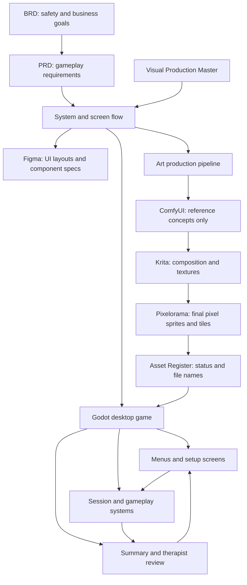
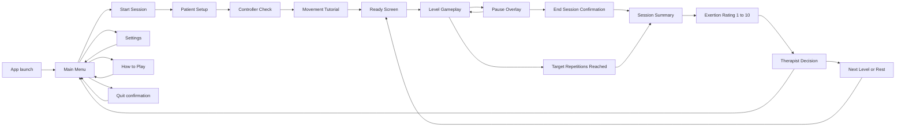
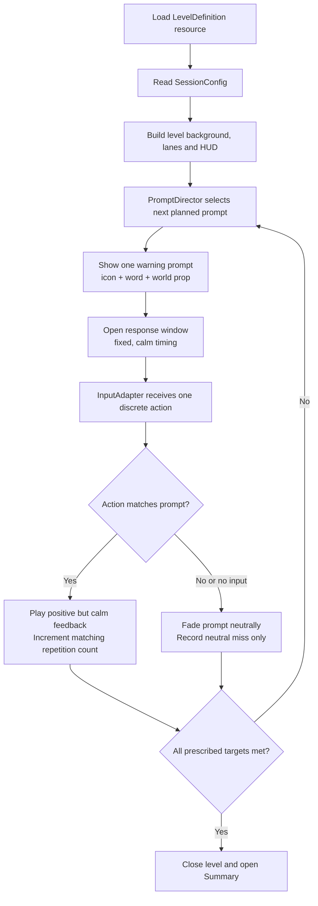
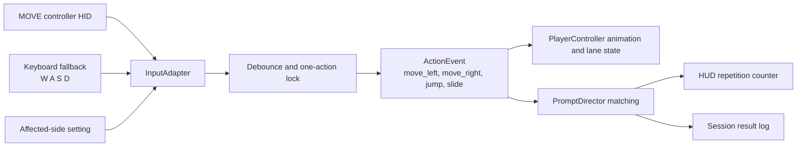
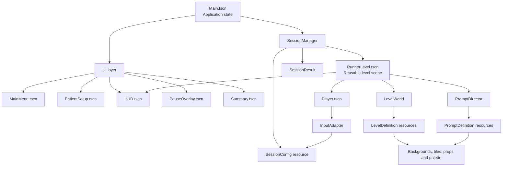
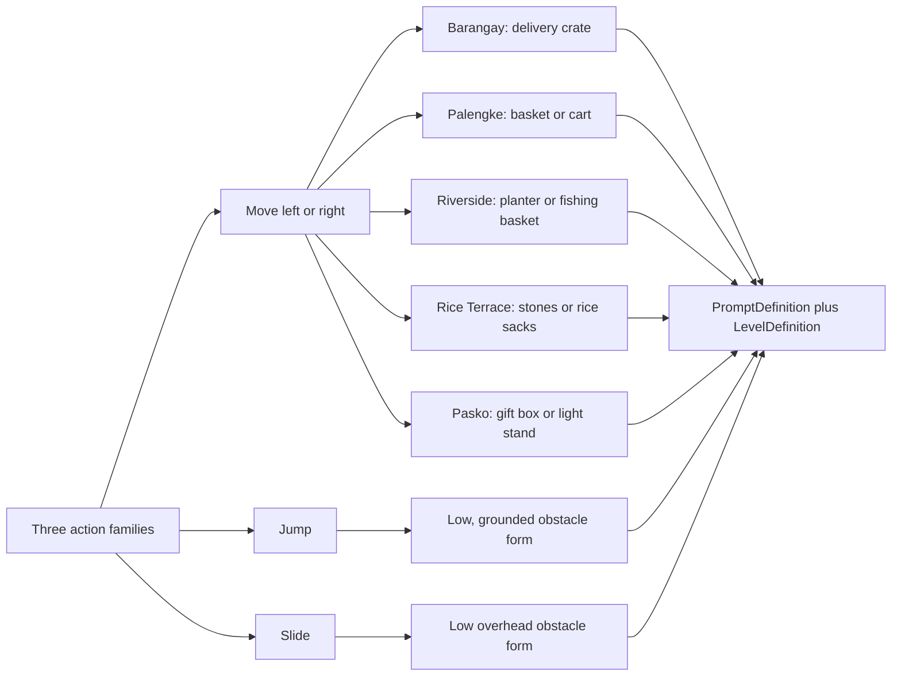
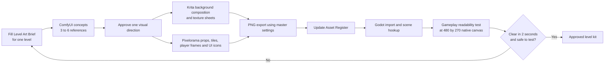
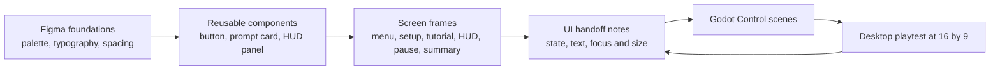
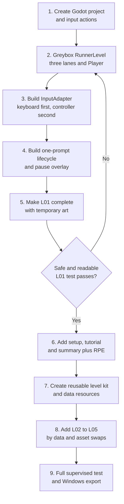

# PETER RUN — End-to-End System & Screen Flow

> **Build map for the playable desktop prototype**  
> **Version 0.1 · 05 September 2026**

This is the practical connection map for the game: what is designed, what appears on each screen, what Godot system owns it, and how a patient action becomes safe gameplay feedback. It is intentionally a diagram document, not a visual-art image.

## 1. Read this with the source documents

| Document | Decides |
| --- | --- |
| [BRD](../Peter_Run_BRD.md) | Why the game exists, supervision and safety boundaries |
| [PRD](../Peter_Run_PRD.md) | Exact functional requirements, input behaviour and test criteria |
| [Visual Production Master](00_Visual_Production_Master.md) | Art pipeline, asset rules and level identity |
| [2.5D Originality Standard](11_2_5D_Originality_Standard.md) | Camera, layer order and originality boundary |
| This flow | How the screens, systems, assets and data connect |

**Rule of authority:** if a flow idea conflicts with patient safety, the BRD wins. If visual polish conflicts with clear, calm gameplay, the PRD wins. The player is never punished for a missed movement: no collision damage, chase, countdown pressure, or game-over screen.

---

## 2. One-page system map



The three production tools have different jobs. ComfyUI creates a mood/reference image; Krita makes a clean environment composition or texture; Pixelorama creates the final, grid-aligned game PNGs. Only the final exported PNGs are loaded by Godot.

The playable camera is a **2D 2.5D illusion**: fixed player, downward-scrolling route and slow parallax layers. It is not a 3D scene and must not use commercial-runner routes, reward loops, UI patterns or character designs.

---

## 3. Game screen navigation

Every box below is a Godot scene or UI state. Arrows are intentional navigation routes, not background decoration.



### Screen contract

| Screen | Purpose | Required elements | User input | Exit condition |
| --- | --- | --- | --- | --- |
| Main Menu | Safe starting point | Start Session, Settings, How to Play, Quit | Mouse/trackpad | Start Session or another menu item selected |
| Patient Setup | Configure this supervised session | Patient ID or nickname, affected-side toggle, prescribed reps, level selection | Mouse/trackpad | Therapist confirms settings |
| Controller Check | Confirm the physical input source is responding | Connection status, left/right/jump/slide test indicators, keyboard fallback note | Movement input plus mouse | All needed actions detected or therapist selects fallback |
| Movement Tutorial | Teach one action at a time | Large icon, plain-language instruction, demo lane, repeat button, pause control | Movement input | Each required action is acknowledged; therapist may skip |
| Ready Screen | Remove surprise before play begins | Level name, calming still background, target repetitions, Start button | Mouse/trackpad | Therapist selects Start |
| Level Gameplay | Deliver a calm repetition session | Background, player, one active prompt, progress, clear Pause control | Movement input; mouse for Pause | Target reached, or session is ended |
| Pause Overlay | Stop immediately without loss or penalty | Resume, End Level, End Session, input status | Mouse/trackpad | Resume or confirmed end path |
| Summary + RPE | Record outcome and perceived exertion | Completed reps, neutral misses, duration if useful, 1–10 exertion choice, notes | Mouse/trackpad | Therapist selects next step |
| Therapist Decision | Decide what happens after the data is visible | Rest, retry, next level, finish session | Mouse/trackpad | A conscious therapist selection |

### What must never be on the play screen

- A countdown that forces faster movement.
- Multiple competing prompts.
- A score that is treated as success or failure.
- A game-over, crash, enemy, or chase presentation.
- A small or hidden Pause control.

---

## 4. Gameplay loop: from level data to a completed repetition



### Prompt lifecycle rules

1. `PromptDirector` may own only **one active prompt**.
2. The prompt is always expressed in three ways: icon, word, and distinct obstacle silhouette.
3. An action is a deliberate, debounced trigger; sustained pressure or a noisy sensor signal must not count as several repetitions.
4. A correct action increments only its own prescribed count.
5. A miss ends quietly. It does not remove health, reduce a score, stop the player, or replay a shaming sound.
6. The level completes when prescribed movement targets are reached, not when a score or time threshold is reached.

---

## 5. Input-to-game connection

Godot gameplay must receive a simple action name. It must not need to interpret raw sensor angles, controller noise, or which leg is affected.



| Physical intention | Development keyboard | Godot action | Runtime result |
| --- | --- | --- | --- |
| Step toward left lane | `A` | `move_left` | Player moves one lane left; counts only when a matching lane prompt is active |
| Step toward right lane | `D` | `move_right` | Player moves one lane right; counts only when a matching lane prompt is active |
| Forward step | `W` | `jump` | Player performs readable forward-step/jump animation and resolves a jump prompt |
| Backward step | `S` | `slide` | Player performs readable backward-step/duck animation and resolves a slide prompt |
| Immediate stop | Mouse Pause button | `pause_session` | Gameplay, timers and prompt flow freeze immediately |

**Affected-side record:** this is stored with the supervised-session configuration. `InputAdapter` preserves literal controller directions: Left always produces `move_left` and Right always produces `move_right`; art, prompt data and `PlayerController` remain unchanged.

---

## 6. Godot scene and data ownership

This separation is what makes five levels possible without duplicating the entire game.



### Recommended resource fields

| Resource | Owns | Does not own |
| --- | --- | --- |
| `SessionConfig` | Affected side, input device, rep targets, chosen level, therapist options | Art assets or individual obstacles |
| `LevelDefinition` | Level ID, title, palette, background set, lane layout, safe prompt sequence, timing profile | Player input mappings |
| `PromptDefinition` | Action type, icon, label, world prop asset, silhouette size, audio cue reference | Total target count or session outcome |
| `SessionResult` | Completed reps, neutral misses, RPE, notes, completed level ID | Navigation or visual layout |
| `Asset Register` | File paths, version, owner, readiness and approvals | Runtime logic |

### Reusable scene structure

```text
RunnerLevel.tscn
├── LevelWorld
│   ├── BackgroundFar
│   ├── BackgroundMid
│   ├── LaneTileMap
│   └── PromptWorldAnchor
├── Player
├── PromptDirector
├── HUD
└── PauseOverlay
```

Each level swaps `LevelDefinition` and art assets. It reuses the player, lanes, prompt lifecycle, HUD, pause behaviour, and summary flow.

---

## 7. Level kit connection

The same three action families appear in every level. Only the culturally inspired visual form changes, so the player learns a stable visual language.



| Level | Lane-change prop | Jump prop | Slide prop | Background identity |
| --- | --- | --- | --- | --- |
| L01 Barangay Morning | Small delivery crates | Low curb or tiny puddle | Laundry line or low awning | Sari-sari store, homes, morning light |
| L02 Palengke Dash | Fruit baskets or market carts | Empty crate stack | Hanging market banner | Produce stalls and bunting |
| L03 Riverside Walk | Bamboo planter or fishing basket | Wooden bridge-gap marker | Low bamboo branch | River, footbridge and palms |
| L04 Rice Terrace Trail | Stones or rice-sack bundles | Path step or stream marker | Low bamboo arch or leaves | Rice terraces and mountain trail |
| L05 Pasko Festival | Decorative gift boxes or light stands | Raised plaza tile or ribbon line | Low parol string or festival banner | Evening plaza, parols and warm lights |

The word label and action icon stay stable across all five levels. A player should never have to learn a new meaning because the theme changed.

---

## 8. Visual production handoff



### Handoff checklist

| From | To | Deliverable | Check before handoff |
| --- | --- | --- | --- |
| Game designer | Artist | Completed Level Art Brief | Correct action mapping and target level named |
| ComfyUI | Krita / Pixelorama | Reference board only | Original imagery; no copied game assets or logos |
| Krita | Godot | Background layers / texture PNGs | Readable lanes; no visual clutter at HUD or Pause location |
| Pixelorama | Godot | Grid-aligned props, icons, tiles, sprite sheets | Exact pixel sizes, transparent PNG, correct naming/version |
| Godot | Therapist / product owner | Playable level build | One prompt at a time; pause works; no punitive response |
| Tester | Asset Register | Pass/fail notes and revised version link | Visual and safety evidence recorded |

For detailed export settings, use [Pixelorama Sprite and Export Spec](06_Pixelorama_Sprite_and_Export_Spec.md), [Krita Environment Pipeline](07_Krita_Environment_Pipeline.md), and [Godot Art Integration Spec](08_Godot_Art_Integration_Spec.md).

---

## 9. Figma-to-Godot UI handoff

Figma is the layout and component reference. Godot is the actual interactive implementation. A Figma frame is never the runtime game itself.



### UI component inventory

| Component | Used on | States that must be designed | Godot implementation |
| --- | --- | --- | --- |
| Primary Game Button | Main Menu, Ready, Summary | Default, hover, pressed, disabled, keyboard focus | Reusable `Button` theme/component |
| Pause Button | Gameplay HUD | Always visible, hover, pressed | Dedicated button, never hidden by scenery |
| Action Prompt Card | Tutorial and Gameplay | Move, Jump, Slide; warning, active, resolved | `Control` driven by `PromptDirector` |
| Rep Progress Panel | Gameplay and Summary | Zero, in-progress, target met | HUD `Control` bound to session data |
| Controller Status | Setup and Pause | Connected, fallback keyboard, disconnected | UI bound to `InputAdapter` status |
| Exertion Selector | Summary | Ratings 1 through 10, selected, unselected | Large selectable buttons; mouse/trackpad only |
| Confirmation Dialog | End Level / End Session / Quit | Default and destructive confirmation | Reusable modal `Control` |

---

## 10. MVP build order

Build in vertical slices so the first playable level proves the hard parts before art is produced for all five themes.



### Suggested 2–3 day prototype scope

| Day | Must finish | Do not spend time on yet |
| --- | --- | --- |
| Day 1 | Keyboard-controlled L01 greybox, Pause, one prompt lifecycle, correct/neutral response | Detailed scenery, all five levels, complex animation |
| Day 2 | Setup, tutorial, HUD, summary/RPE; reusable data-driven level system; final L01 visual kit | Online accounts, leaderboards, procedural levels |
| Day 3 | L02–L05 theme swaps, controller test if hardware is ready, UI polish, Windows build | Extra characters, shops, monetisation, enemies |

If the MOVE controller is not available on Day 3, keep the keyboard adapter as the verified development fallback and mark hardware integration as a separate test task. Do not fake a successful hardware test.

---

## 11. Acceptance checks before calling the prototype complete

### Screen flow

- The user can start at Main Menu, complete setup, tutorial, a level, RPE and return safely to Main Menu.
- Pause is reachable during tutorial and level gameplay, and immediately freezes the prompt timer and player motion.
- Ending a session asks for confirmation and leads to the same neutral Summary screen.

### Gameplay flow

- Exactly one active instruction is visible at all times during an action cycle.
- Every prompt presents icon + word + object silhouette; colour is optional reinforcement, never the only meaning.
- A correct input increments the correct target. An incorrect or absent input is recorded neutrally and continues safely.
- A level finishes only when the prescribed repetitions are met.

### Art flow

- Every runtime asset has a registered source file, version and readiness state.
- Final assets use the `480 × 270` / `16 × 16` standards from the Visual Production Master.
- Filipino-inspired locations are presented respectfully and originally; no copied Subway Surfers art, names, logos, or interface patterns.

### Technical flow

- Keyboard input works independently from controller input.
- The affected-side setting changes only lateral mapping at `InputAdapter` level.
- L01 through L05 are selected by `LevelDefinition` data rather than separate copies of gameplay code.
- The Windows desktop build starts, pauses, ends and returns to Main Menu without errors.

---

## 12. The next concrete action

Start with **L01 Barangay Morning** only:

1. Make the `RunnerLevel.tscn` greybox with three visible lanes, a player placeholder, a persistent Pause button, and one prompt anchor.
2. Implement `InputAdapter` with `A`, `D`, `W`, `S` first, debounced into four action events.
3. Implement one L01 delivery-crate lane prompt, one curb/puddle jump prompt, and one laundry-line slide prompt.
4. Test the complete path from Setup → Tutorial → L01 → Summary → RPE.
5. When that flow is safe and readable, duplicate the level data and art kit for L02–L05.

This preserves the important distinction: the game is simple to build because the underlying loop is reusable; the visual work is organised as a controlled, testable layer on top of it.
